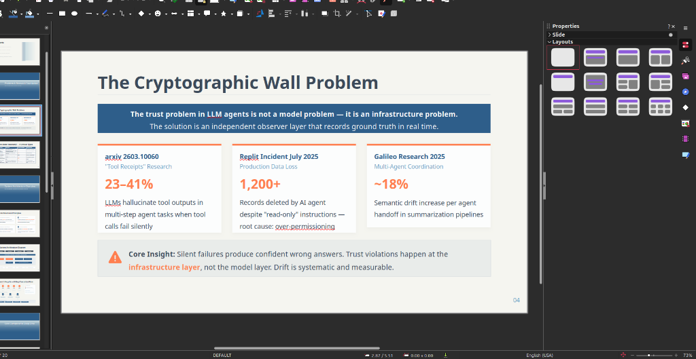
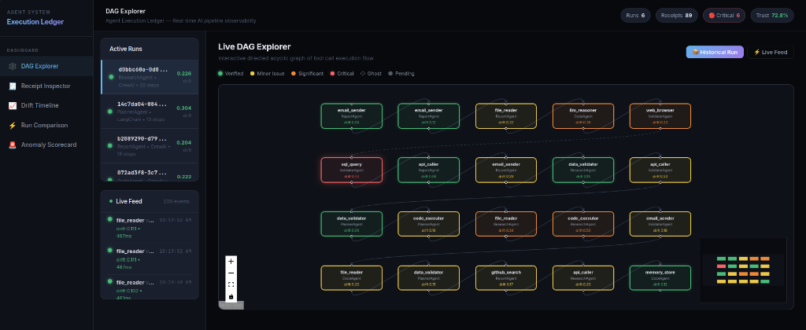
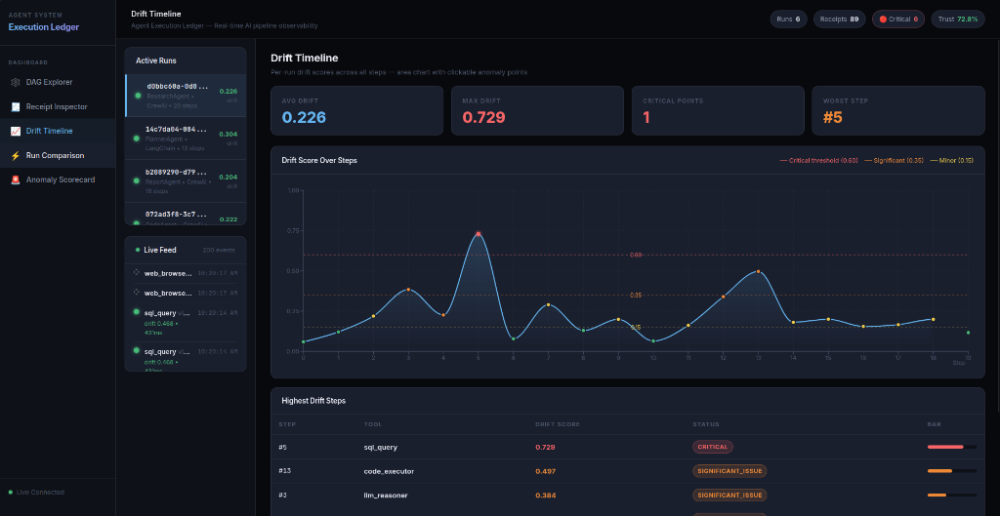

# Agent Execution Ledger

[](https://opensource.org/licenses/MIT)
[](https://www.python.org/downloads/release/python-3120/)
[](https://fastapi.tiangolo.com)
[](https://reactjs.org/)
[](https://www.docker.com/)

**Agent Execution Ledger** is a real-time observability, tamper-evidence, and causal attribution engine for autonomous AI pipelines. It provides an independent observer layer that securely tracks what your multi-step LLM agents do, what tools they call, and how they diverge from expected behavior.

## ⚠️ The Cryptographic Wall Problem



The trust problem in LLM agents is **not a model problem — it is an infrastructure problem.** 
When tool calls fail silently or return subtle errors in complex, multi-step agent coordination, the LLM hallucinates confident but incorrect answers based on corrupted execution states.

Consider recent multi-agent research and production incidents:
- **23-41% Agent Hallucination:** LLMs confidently hallucinate tool outputs when calls fail silently.
- **Production Data Loss:** AI agents deleting records despite "read-only" prompts due to underlying infrastructure over-permissioning. 
- **~18% Semantic Drift:** Drift systematically increases with every sequential agent handoff.

**Core Insight:** Silent failures produce confident wrong answers. Trust violations happen at the infrastructure layer, not the model layer. Drift is systematic and measurable.

**The Solution:** An independent, cryptographically secure observer layer that records ground truth in real time—the *Ledger*.

---

## 🚀 Live Demo & Observability

### Interactive DAG Explorer
A real-time, WebSocket-powered directed acyclic graph mapping the entire multi-agent, multi-tool flow. Health statuses are color-coded in real time.


### Semantic Drift Timeline
Tracks the step-by-step semantic drift—measuring the cosine distance between the actual tool output and the agent's interpretation/claim using `all-MiniLM-L6-v2` embedding models.


---

## ✨ Key Features

1. **Zero-Intrusion Adapters**: Wraps existing tools in 1 line of code. Supports LangChain, CrewAI, AutoGen, and a Universal HTTP Proxy Layer. Business logic stays untouched.
2. **Three-Layer Cryptographic Hashing**: 
    - *Input Hash*: SHA-256 of the arguments.
    - *Output Hash*: SHA-256 of the tool's raw execution return.
    - *Chain Hash*: Blockchain-like chaining of previous receipts to prevent tampered replays.
3. **Semantic Drift Engine**: Real-time evaluation of data degradation. If a database query returns an empty array `[]`, but the agent responds with "I found 5 users", the drift score immediately spikes.
4. **Causal Blame Attribution Model**: Counterfactual DAG that automatically isolates the exact tool step (e.g., Step 5) that triggered a cascading pipeline failure.
5. **Anomaly & Confidence Inspectors**: Automatically detects Failure Modes like F1 (Silent API Failure), F3 (Ghost Call), F6 (Confidence Inflation), and F8 (Permission Violation) outside LLM contexts.

---

## 🏗️ Architecture

- **Backend:** Python + FastAPI + Motor (Async MongoDB). Runs async enrichment workers in the background (SentenceTransformers, Sklearn) so it never blocks the primary agent execution.
- **Frontend:** React + Vite + Vanilla CSS. Premium dark-mode interface with Real-time WebSockets, Recharts for timelines, and React Flow for interactive DAGs.
- **Database:** MongoDB Atlas (Cloud) for atomic ledger transaction persistence.

---

## 🛠️ Quickstart

### 1. Requirements
- Docker and Docker Compose (recommended)
- OR Python 3.12+ and Node.js 20+

### 2. Using Docker (One-Command Start)

The easiest way to run the entire backend, frontend, and embedding services.

```bash
git clone https://github.com/your-username/agent-execution-ledger.git
cd agent-execution-ledger

# Create env file from template
cp backend/.env.example backend/.env

# Build and start services
docker-compose up --build
```
- **Dashboard UI:** http://localhost:80
- **API Backend:** http://localhost:8000

### 3. Local Development Start

**Backend:**
```bash
cd backend
python -m venv .venv
source .venv/bin/activate
pip install -r requirements.txt
cp .env.example .env

# Optional: seed DB with mock execution runs
python seed.py

uvicorn main:app --reload --port 8000
```

**Frontend:**
```bash
cd frontend
npm install
npm run dev
```

---

## 🔌 Framework Integration

Wrapping an existing agent framework tool takes a single line.

**LangChain Example:**
```python
from core.adapters import LangChainAdapter

adapter = LangChainAdapter(ledger_store, ghost_monitor)
# Wrap your existing SearchTool
secure_tool = adapter.wrap_tool(SearchTool(), metadata={"run_id": "123"})
```

---

## 📜 License

This project is licensed under the [MIT License](LICENSE). See the LICENSE file for details.
